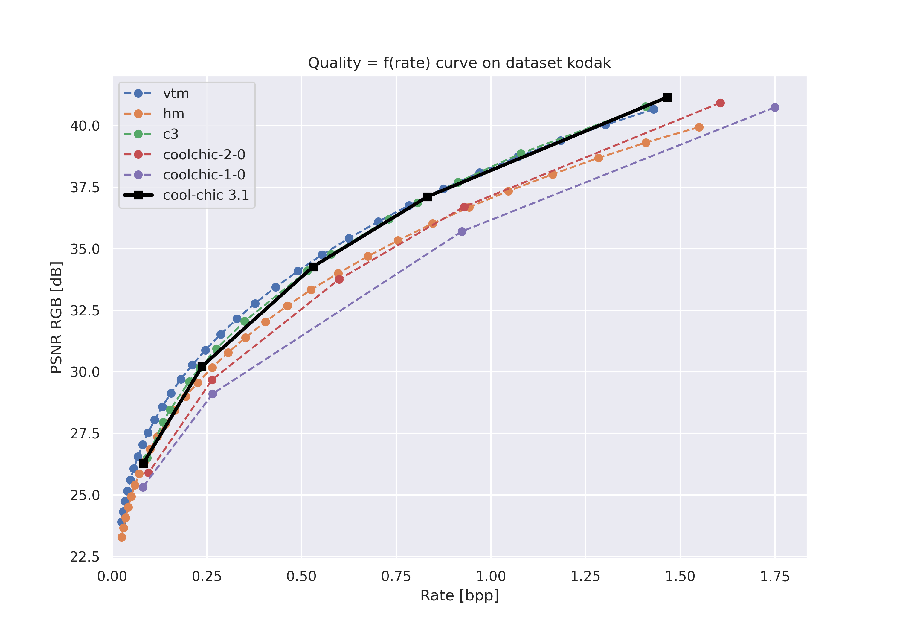
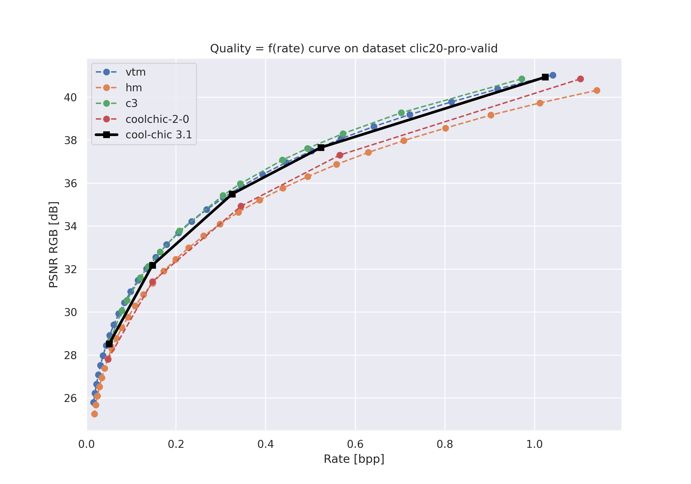
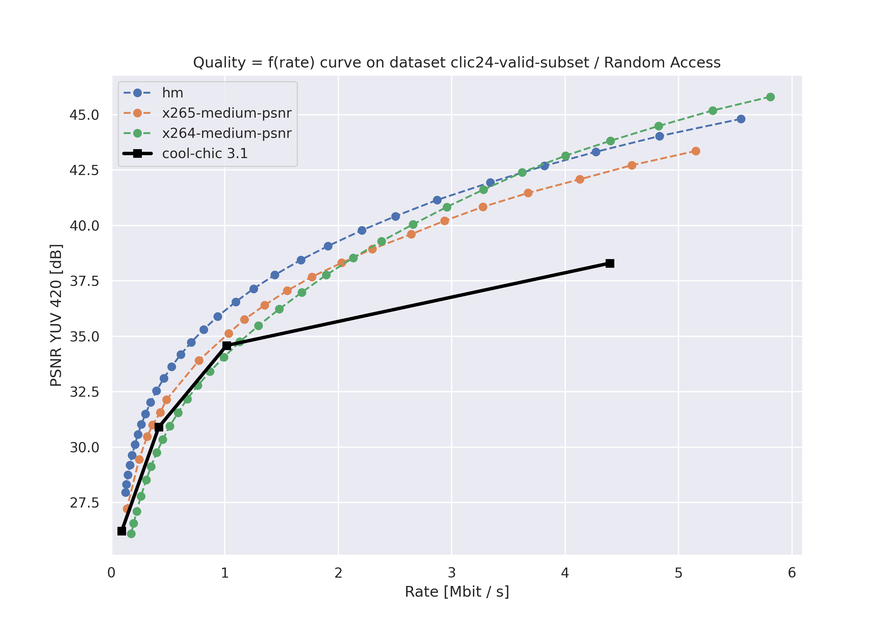

Compression performance
=======================

.. raw:: html

    
    

.. role:: red

.. role:: green

Reproduce our current best results
"""""""""""""""""""""""""""""""""""

We provide already encoded files as bitstreams in ``results/<configuration>/<dataset_name>/``

* ``<configuration>`` can be ``image``, ``video-low-latency``, ``video-random-access``
* ``<dataset_name>`` can be ``kodak, clic20-pro-valid, clic24-valid-subset, jvet``.

These bitstreams allow to reproduce the results stated above qnd reflect the current best rate-distortion results achievable with Cool-chic.

For each dataset, a script decodes all the bitstreams.

.. code:: bash

    (venv) python results/decode_one_dataset.py <configuration> <dataset_name> # Can take a few minutes

The file ``results/<configuration>/<dataset_name>/results.tsv`` provides the results that should be obtained.

Image compression
"""""""""""""""""

Image compression performance are presented on the kodak and clic20-pro-valid dataset.

The following table sums up the compression performance obtained by Cool-chic 3
against different anchors.

+------------------+---------------------+----------------------+------------------------+-------------------------+------------------------+------------------------------------------+------------------------------------------+------------------------------------------+
| Dataset          | vs. Cool-chic 2 [%] | vs. Cool-chic 1 [%]  | vs. C3, Kim et al. [%] | vs. HEVC (HM 16.20) [%] | vs. VVC (VTM 19.1) [%] | Minimum decoder complexity [MAC / pixel] | Maximum decoder complexity [MAC / pixel] | Average decoder complexity [MAC / pixel] |
+==================+=====================+======================+========================+=========================+========================+==========================================+==========================================+==========================================+
| kodak            | \ :green:`-18.3`    | \ :green:`-28.1`     | \ :green:`-0.2`        | \ :green:`-13.4`        | \ :red:`+8.1`          | 299                                      | 2291                                     | 1281                                     |
+------------------+---------------------+----------------------+------------------------+-------------------------+------------------------+------------------------------------------+------------------------------------------+------------------------------------------+
| clic20-pro-valid | \ :green:`-15.8`    | /                    | \ :red:`+4.6`          | \ :green:`-20.5`        | \ :red:`+3.5`          | 545                                      | 2288                                     | 1590                                     |
+------------------+---------------------+----------------------+------------------------+-------------------------+------------------------+------------------------------------------+------------------------------------------+------------------------------------------+

✨ YUV 420 image coding results coming soon

Video compression
"""""""""""""""""

Video compression performance are presented on the first 33 frames (~= 1 second) from the `CLIC24 validation subset <https://storage.googleapis.com/clic2023_public/validation_sets/clic2024_validation_video_30.zip>`_, composed of 30 high resolution videos. We provide results for 2 coding configurations:

* Low-delay P: address use-cases where low latency is mandatory;
* Random access: address use-cases where compression efficiency is primordial e.g. video streaming.

+------------------+-------------------------+----------------------+----------------------+------------------------------------------+------------------------------------------+------------------------------------------+
| Dataset          | vs. HEVC (HM 16.20) [%] | vs. x265 medium. [%] | vs. x264 medium. [%] | Minimum decoder complexity [MAC / pixel] | Maximum decoder complexity [MAC / pixel] | Average decoder complexity [MAC / pixel] |
+==================+=========================+======================+======================+==========================================+==========================================+==========================================+
| kodak            | \ :red:`+65.6`          | \ :green:`+21.5`     | \ :green:`-12.2`     | 460                                      | 460                                      | 460                                      |
+------------------+-------------------------+----------------------+----------------------+------------------------------------------+------------------------------------------+------------------------------------------+

✨ Low-delay P coding results coming soon!

