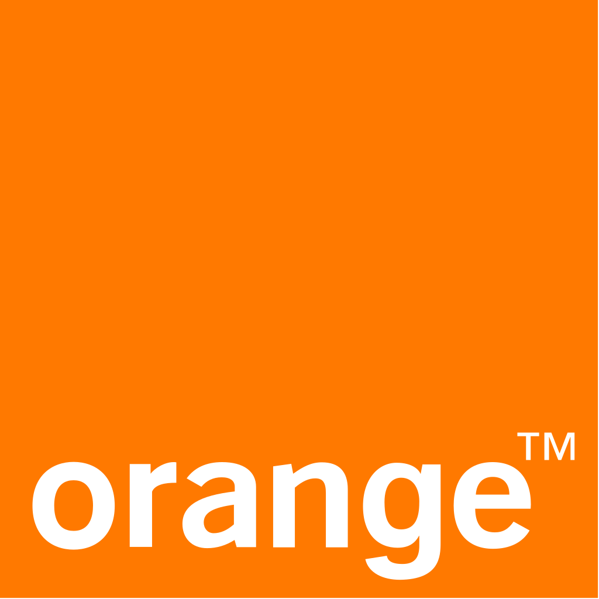

.. Cool-chic documentation master file, created by
   sphinx-quickstart on Thu Jan 11 13:55:54 2024.
   You can adapt this file completely to your liking, but it should at least
   contain the root `toctree` directive.

Cool-chic
=========

**Cool-chic** (pronounced /kul ʃik/ as in French 🥖🧀🍷) is a low-complexity neural image and video codec based on overfitting. Image coding performance are on par with VVC for 2000 multiplication per decoded pixels, while video coding performance compete with AVC with as few as 500 multiplication per decoded pixels.

`Go to Cool-chic GitHub repository. <https://github.com/Orange-OpenSource/Cool-Chic>`_

Version history
"""""""""""""""

* Fev. 24: version 3.1
    - Cool-chic video from `Cool-chic video: Learned video coding with 800 parameters, Leguay et al. <https://arxiv.org/abs/2402.03179>`_
    - Random access and low-delay video coding, competitive with AVC.
* January 24: version 3.0
    - Implement some encoder-side improvements from `C3: High-performance and low-complexity neural compression from a single image or video, Kim et al <https://arxiv.org/abs/2312.02753>`_
    - :doc:`15% to 20% rate decrease <./getting_started/results>` compared to Cool-chic 2
* July 23: version 2
    - Based on `Low-complexity Overfitted Neural Image Codec, Leguay et al. <https://arxiv.org/abs/2307.12706>`_
    - Decoder changes: convolution-based synthesis, learnable upsampling module
    - Friendlier usage: support for YUV 420 input format in 8-bit and 10-bit & Fixed point arithmetic for cross-platform entropy (de)coding
* March 23: version 1
    - Based on `COOL-CHIC: Coordinate-based Low Complexity Hierarchical Image Codec, Ladune et al. <https://arxiv.org/abs/2212.05458>`_

🏎️ 🔥 Up to come: a fast decoder implementation will be released soon for near real-time CPU decoding 🏎️ 🔥

Thanks
""""""

Special thanks go to:

* **Robert Bamler** for the `constriction package
  <https://github.com/bamler-lab/constriction>`_ which serves as our entropy
  coder. More details in `Understanding Entropy Coding With Asymmetric Numeral
  Systems (ANS): a Statistician's Perspective, Bamler
  <https://arxiv.org/pdf/2201.01741.pdf>`_.
* **Hyunjik Kim, Matthias Bauer, Lucas Theis, Jonathan Richard Schwarz and Emilien
  Dupont** for their great work enhancing Cool-chic: `C3: High-performance and
  low-complexity neural compression from a single image or video, Kim et al.
  <https://arxiv.org/abs/2312.02753>`_

.. toctree::
   :maxdepth: 1
   :caption: Getting started

   Quickstart <getting_started/quickstart>
   Literature <getting_started/literature>
   Results <getting_started/results>

.. toctree::
   :maxdepth: 1
   :caption: Decoding

   Decoding a bitstream <decoding/decoding_images>

.. toctree::
   :maxdepth: 1
   :caption: Encoding your own files

   Overview <encoding/overview>
   Architecture <encoding/architecture>
   Presets <encoding/preset>
   Video <encoding/video>

.. toctree::
   :maxdepth: 1
   :caption: Code Documentation

   At a glance <code_documentation/overview>

.. .. toctree::
..    :maxdepth: 1
..    :caption: Code Documentation

..    encoding_management <encoding_management>
..    models <models>
..    utils <utils>
..    visu <visu>

